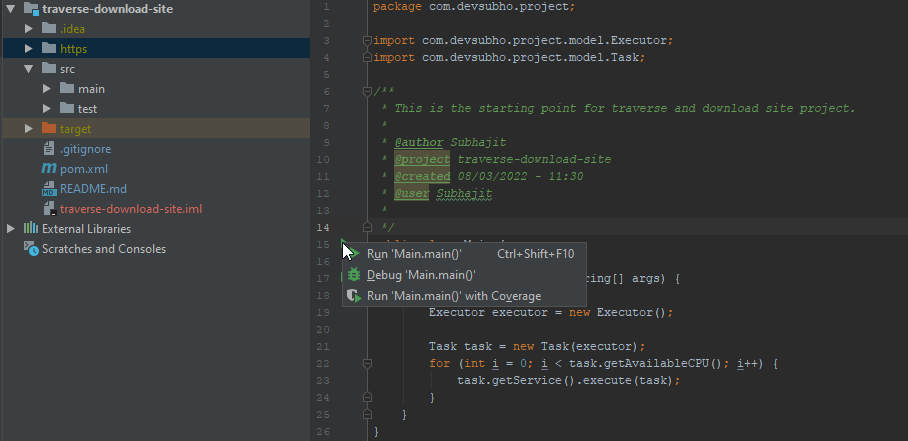
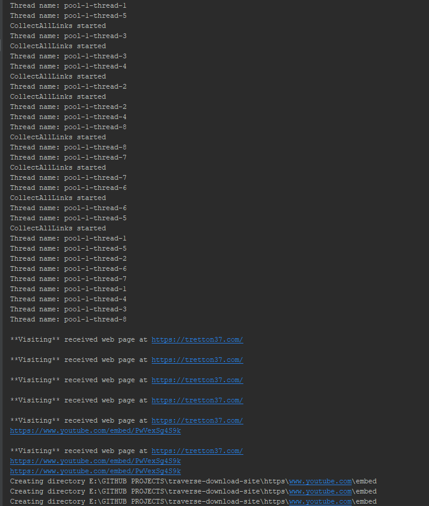

# traverse-download-site

Console program in Java that can recursively traverse and download a site and 
save it to disk while keeping the online file structure. Show download progress in the console.

## Definitions:

**JSoup:** jsoup is a Java library for working with real-world HTML. 
       It provides a very convenient API for fetching URLs and extracting and manipulating data, 
       using the best of HTML5 DOM methods and CSS selectors.
**Lombok:** Project Lombok is a java library that automatically plugs into your editor and build tools, 
        spicing up your java.
       
## Versions Used:
Java: 1.8  
Jsoup: 1.14.3  
JUnit: 4.13.2  
Lombok: 1.18.22  

## Planning:

1) Use jsoup to connect
2) Defining models, services and constant files
3) Crawling tretton website
4) Methods for scanning of all folders and files with all levels
5) Downloading and saving on the local disk
6) Display the whole process on console
7) Handling exceptions
8) Wring test cases

## Project Structure
- Model
  - Site 
  - Printer: for displaying the process in console 
  - Task: for threads handle
  - Loader: for saving process
  - Executor: creates before all threads are created
- Service
  - Interfaces for Web crawler and Files downloader
  - Service implementation classes to handle crawling, folder and file creation
- Tests
  - Loader test
  - Crawler Test

## Running the application:

Right click on Main class or click on green button for IntelliJ and click 'Run'

## Console Output:

